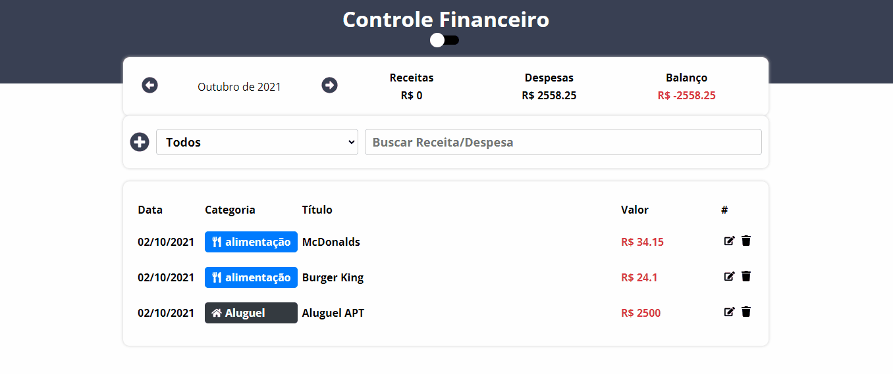

## App de controle Financeiro (Desafio B7Web 5 Em 5)

* 🚀 Versão melhorada: 

    

## 😍 Fui além 

-  ✔️ Implementação de ThemeSwitcher
-  ✔️ Adicionar Item
-  ✔️ Filtar por titulo
-  ✔️ Filtrar por categoria
-  ✔️ Icones
-  ✔️ Deletar Item

## ⚙ Pré Requisitos

- Antes de iniciar o projeto, você vai precisar das seguintes ferramentas: 
    - ✔️ [NodeJS](https://nodejs.org/en/download/)

<br>

## 🚀 Tecnologias Usadas

Neste projeto foram usadas essas tecnologias:

- ✔️ [React](https://pt-br.reactjs.org/)

- ✔️ [Styled-components](https://styled-components.com/docs/basics#installation)

- ✔️ [TypeScript](https://www.typescriptlang.org/)

- ✔️ [React-Switch](https://www.npmjs.com/package/react-switch)

- ✔️ [React-tooltip](https://www.npmjs.com/package/react-tooltip)

- ✔️ [ReactHooks](https://pt-br.reactjs.org/)

<br>

## Clonar o repositório
```bash
$ git clone https://github.com/FilipePaiva10/D2ControleFinanceiro.git
```

## Acessar Pasta
```bash
cd gerenciador-financeiro
```

## Instalar dependências
```bash
npm install
```

## Rodar Projeto
```bash
npm start
```

## 😃 [Meu Likedln](https://www.linkedin.com/in/filipepaiva10/)


